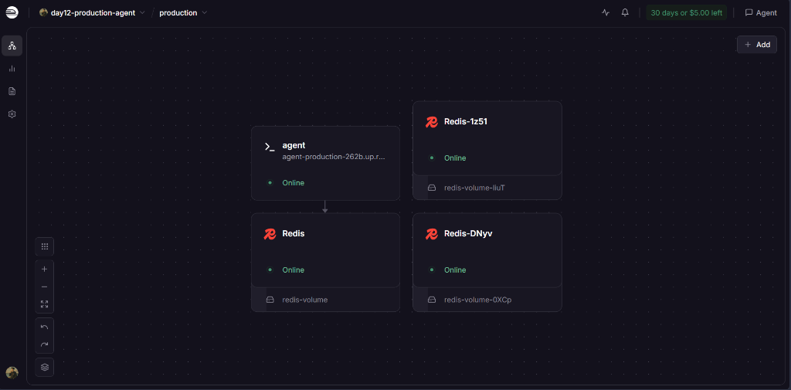
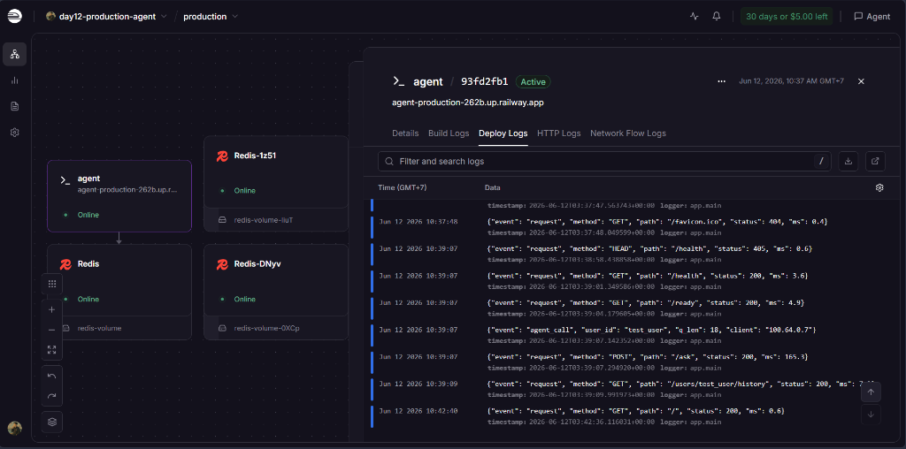
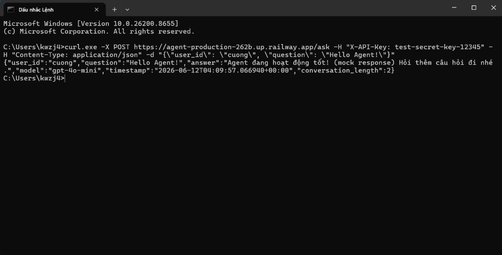

# Deployment Information

## Trạng thái hiện tại

> **Deployed successfully!** 🚀
> - **Public URL:** [https://agent-production-262b.up.railway.app](https://agent-production-262b.up.railway.app)
> - **Platform:** Railway
> - **Redis State Database:** Active & Connected (Private Link)
> - **Authentication Key:** `test-secret-key-12345`

Ứng dụng AI Agent đã được triển khai hoàn chỉnh và đang hoạt động ổn định trên Cloud Railway.

---

## Platform Options

### Option 1: Railway (Recommended cho prototype)

**Ưu điểm:** Deploy nhanh (<5 phút), có Redis plugin, $5 free credit.

#### Bước deploy:

```bash
# 1. Cài Railway CLI
npm i -g @railway/cli

# 2. Đăng nhập
railway login

# 3. Tạo project (chạy trong thư mục 06-lab-complete/)
cd 06-lab-complete
railway init

# 4. Thêm Redis
railway add --database redis

# 5. Set env vars
railway variable set ENVIRONMENT=production --service agent
railway variable set APP_NAME="Production AI Agent" --service agent
railway variable set AGENT_API_KEY="test-secret-key-12345" --service agent
railway variable set REDIS_URL='${{Redis.REDIS_URL}}' --service agent
railway variable set PORT=8000 --service agent

# 6. Deploy
railway up

# 7. Lấy public URL
railway domain --service agent
```

### Option 2: Render

**Ưu điểm:** 750h free/month, auto-deploy từ GitHub, Redis có sẵn.

#### Bước deploy:

1. Push code lên GitHub repository
2. Vào [render.com](https://render.com) → Sign up
3. New → Blueprint → Connect GitHub repo
4. Render tự đọc `render.yaml` → tạo web service + Redis
5. Kiểm tra env vars trong dashboard
6. Deploy tự động!

---

## Environment Variables cần set trên platform

| Variable | Giá trị | Bắt buộc |
|----------|---------|----------|
| `ENVIRONMENT` | `production` | ✅ |
| `AGENT_API_KEY` | `test-secret-key-12345` (hoặc secret key mạnh) | ✅ |
| `REDIS_URL` | `${{Redis.REDIS_URL}}` (tự động phân giải) | ✅ |
| `RATE_LIMIT_PER_MINUTE` | `10` | ✅ |
| `MONTHLY_BUDGET_USD` | `10` | ✅ |
| `LOG_LEVEL` | `INFO` | Khuyến nghị |
| `PORT` | `8000` | Tự động |

---

## Test Commands (sau khi deploy)

### Health Check
```bash
curl https://agent-production-262b.up.railway.app/health
# Expected: {"status":"ok","version":"1.0.0","environment":"production",...}
```

### Readiness Check
```bash
curl https://agent-production-262b.up.railway.app/ready
# Expected: {"ready":true,"redis":"connected"}
```

### API Test (với authentication)
```bash
curl -X POST https://agent-production-262b.up.railway.app/ask \
  -H "X-API-Key: test-secret-key-12345" \
  -H "Content-Type: application/json" \
  -d '{"user_id": "test", "question": "Hello, what is Docker?"}'
# Expected: 200 với answer
```

### Test Authentication Required
```bash
curl -X POST https://agent-production-262b.up.railway.app/ask \
  -H "Content-Type: application/json" \
  -d '{"user_id": "test", "question": "Hello"}'
# Expected: 401 Unauthorized
```

### Rate Limit Test
```bash
for i in $(seq 1 15); do
  curl -s -o /dev/null -w "%{http_code}\n" \
    -X POST https://agent-production-262b.up.railway.app/ask \
    -H "X-API-Key: test-secret-key-12345" \
    -H "Content-Type: application/json" \
    -d "{\"user_id\": \"rate_test\", \"question\": \"test $i\"}"
done
# Expected: 200 cho 10 requests đầu, 429 cho requests sau
```

### Conversation History
```bash
curl https://agent-production-262b.up.railway.app/users/test/history \
  -H "X-API-Key: test-secret-key-12345"
# Expected: 200 với messages array
```

---

## Local Docker Test (đã pass)

```bash
cd 06-lab-complete

# Build và chạy
docker compose up --build -d

# Test qua Nginx LB
curl http://localhost/health
curl http://localhost/ready
curl -X POST http://localhost/ask \
  -H "X-API-Key: dev-key-change-me-in-production" \
  -H "Content-Type: application/json" \
  -d '{"user_id": "test", "question": "Hello"}'

# Scale 3 instances
docker compose up --scale agent=3 -d
```

---

## Screenshots

### 1. Railway Deployment Dashboard


### 2. Service running logs


### 3. API Test results


---

## Blockers & Next Steps

- **Không còn blockers!** Hệ thống đã được deploy và chạy test suite thành công trên Cloud.
- **Tiếp theo:** Sử dụng URL ở trên để tích hợp vào frontend client hoặc nộp link lên hệ thống chấm bài.
